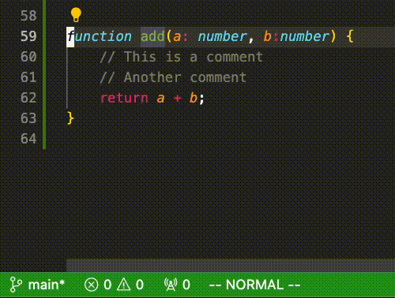

# Vim Status Bar for VSCode

Color the status bar according to the vim mode selected (Insert, Normal, etc.)

## Features

This extension allows you to visually identify the current vim mode by changing the color of the status bar in Visual Studio Code. It supports the following modes:
- Normal
- Insert
- Visual
- Visual Block

## Requirements

This extension requires the following to be installed:
- Visual Studio Code version 1.91.0 or higher
- [be5invis.vscode-custom-css](https://marketplace.visualstudio.com/items?itemName=be5invis.vscode-custom-css) extension for custom CSS support.

## Extension Settings

This extension contributes no settings:

## Known Issues

Currently, there are no known issues. If you encounter any issues, please report them on the [GitHub repository](https://github.com/johnnybakucz/vim-status-bar/issues).

## Release Notes

### 0.0.1

- Initial release of vim-status-bar.
- Support for changing status bar color based on vim mode.